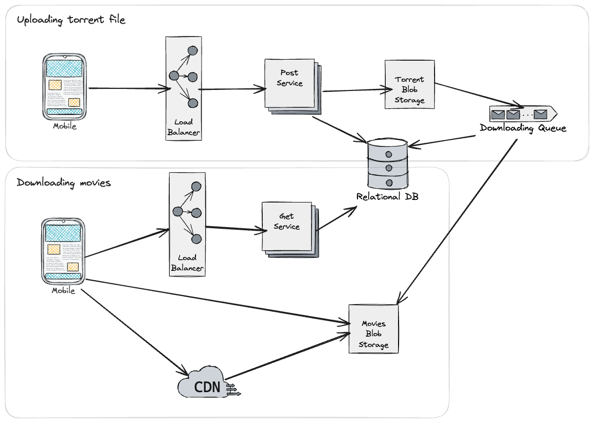

## User Request Flow Description

### Uploading Torrent File
1. User uploads a torrent file. The request is sent to the Load Balancer.
2. Load Balancer routes the request to a Post Service instance.
3. Post Service:
   - Stores the torrent file in Torrent Blob Storage.
   - Saves metadata in the Relational Database.
   - Sends a message to the Downloading Queue.
   
4. Downloading Queue triggers the download of the actual movie file from the torrent.
5. The movie file is downloaded and stored in Movies Blob Storage.

### Downloading Movies
1. The user sends a request. The request is sent to the Load Balancer.
2. Load Balancer routes the request to a Get Service instance.
3. Get Service retrieves movie metadata from the Relational Database and provides the streaming URL.
4. The user streams the movie from Movies Blob Storage or via a CDN for optimized delivery.

### Key Points

- **Efficiency**:
  - Multiple users uploading the same torrent file triggers only one download.
  
- **Scalability**:
  - Load Balancers, distributed services, and CDN ensure the system scales to handle many users.

- **CDN Usage**:
  - CDN is beneficial when movies are popular and accessed by users in different geographic regions. It reduces latency and ensures faster delivery by caching the content closer to users.
